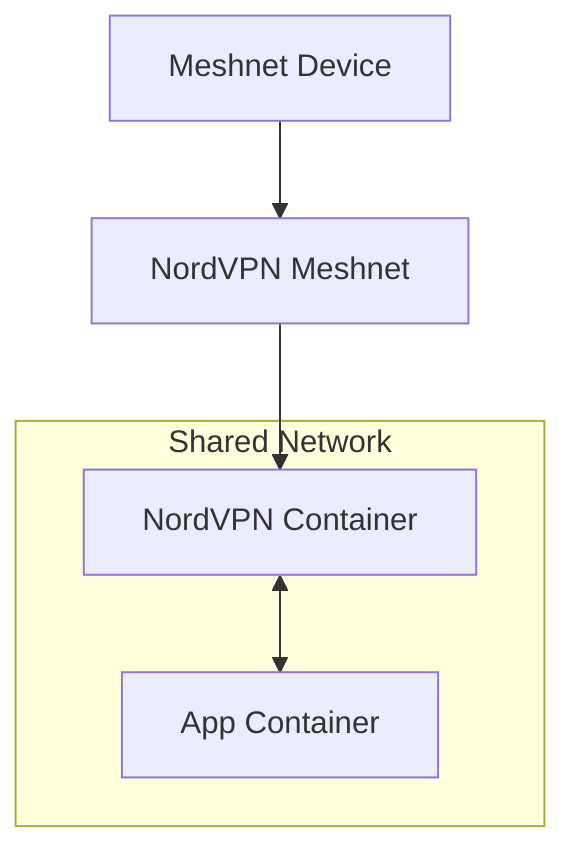

<h1>
  NordVPN Docker Gateway
  <a href="https://github.com/colvdv/nordvpn-docker-gateway/stargazers">
    
  </a>
</h1>

[](https://github.com/colvdv/nordvpn-docker-gateway/commits)
[](https://github.com/colvdv/nordvpn-docker-gateway/releases)
[](https://github.com/colvdv/nordvpn-docker-gateway/blob/main/Dockerfile)
[](https://github.com/colvdv/nordvpn-docker-gateway/blob/main/LICENSE)
[](https://app.codacy.com/gh/colvdv/nordvpn-docker-gateway/dashboard?utm_source=gh&utm_medium=referral&utm_content=&utm_campaign=Badge_grade)
[](https://www.codefactor.io/repository/github/colvdv/nordvpn-docker-gateway)
[](https://github.com/colvdv/nordvpn-docker-gateway/actions/workflows/docker-image.yml)

### **[GUIDE] Route any Docker Container through the official NordVPN Linux Client in a Custom Docker Image (with Meshnet access) without 3rd-Party Tools or Exposing LAN**

> [!NOTE]
> This is an unofficial community project utilizing the official NordVPN Linux client.

***Gateway Topology Overview:***


## Why this guide?
 - **🚫 Third-Party Bloat:** Most online tutorials rely on third-party images (Gluetun, Bubuntux, etc.). This guide uses the official NordVPN Linux client built into a custom image. *It’s cleaner, more secure, and utilizes Meshnet for effortless remote access without opening router ports.*
 - **🔒 Security Sandbox:** Since the [NordVPN client on Linux currently requires local network access to be enabled in order for Meshnet peers to be able to access Docker containers](https://meshnet.nordvpn.com/troubleshooting/linux#cannot-access-docker-containers-over-meshnet), this is a solution that works around that so that you don't have to expose your entire machine or LAN to your Meshnet peers or to mess with firewall stuff to solve that issue.

## Instructions - ([v1.2.5](https://github.com/colvdv/nordvpn-docker-gateway/releases/tag/v1.2.5))
This guide will walk you through the creation of all of the files, their contents, and directories needed in order to route a Docker application container through a Docker NordVPN container. We are using audiobookshelf as the routed container example in this guide, but by changing a few things, you can adapt this guide for any application container.

> [!IMPORTANT]
> I have added a [GitHub Action](https://github.com/colvdv/nordvpn-docker-gateway/actions/runs/26382756311) to build the docker image from [Dockerfile](https://github.com/colvdv/nordvpn-docker-gateway/blob/main/Dockerfile) with each new release. The built image supports both `amd64` and `arm64` architectures and is attached as an asset (e.g.`nordvpn-docker-gateway-v1.x.x.tar.gz`) to the relevant release, starting with [v1.2.5](https://github.com/colvdv/nordvpn-docker-gateway/releases/tag/v1.2.5). View the `nordvpn-docker-gateway` package [here](https://github.com/colvdv/nordvpn-docker-gateway/pkgs/container/nordvpn-docker-gateway).

<details>
<summary><h3 style="display:inline">📋 0. Prerequisites</h3></summary>
  
 - **Docker** installed on a Linux-based host.
 - **Kernel TUN Module:** Your host kernel must have the `TUN` module enabled to create the VPN tunnel.
 - **Network Privileges:** The ability to grant the container `NET_ADMIN` and `NET_RAW` capabilities.
 - **Local Data Directory:** A folder (e.g., `./data`) on your host to persist NordVPN container configuration and Meshnet settings.
 - **Terminal Access:** Basic proficiency with the CLI to run build and deployment commands.

</details>
<details>
<summary><h3 style="display:inline">🛠️ 1. Create the Dockerfile for the NordVPN Container</h3></summary>

Create a directory (e.g. `mkdir ~/nordvpn-meshnet/`), open it (e.g. `cd ~/nordvpn-meshnet/`) and save the following as `Dockerfile` inside it (e.g. `nano Dockerfile`, keyboard shortcut `Shift+Insert` to paste with formatting, then `Ctrl+X` to save, followed by `y` to confirm saving, then `Enter` to confirm filename):

```
# REQUIRED RUNTIME ARGUMENTS:
# --cap-add=NET_ADMIN 
# --cap-add=NET_RAW
# --device /dev/net/tun
#
# JUSTIFICATION:
# NET_ADMIN: Required for NordVPN to modify routing tables and iptables.
# NET_RAW: Required for NordVPN to create and manage raw sockets.
# /dev/net/tun: Required for the creation of the VPN tunnel interface.

FROM ubuntu:24.04@sha256:c4a8d5503dfb2a3eb8ab5f807da5bc69a85730fb49b5cfca2330194ebcc41c7b

LABEL org.opencontainers.image.authors="COLVDV" \
      org.opencontainers.image.title="NordVPN Docker Gateway" \
      org.opencontainers.image.description="NordVPN Docker Gateway with Meshnet" \
      org.opencontainers.image.version="1.2.5" \
      org.opencontainers.image.url="https://github.com/colvdv/nordvpn-docker-gateway" \
      org.opencontainers.image.licenses="MIT" \
      capabilities.net_admin="required" \
      capabilities.net_raw="required"

# Optimized build layer
RUN apt-get update && apt-get install -y --no-install-recommends \
    wget \
    gnupg \
    ca-certificates \
    iproute2 \
    iptables \
    gosu \
    && mkdir -p -m 0700 /root/.gnupg \
    && wget -qO /tmp/nordvpn.asc https://repo.nordvpn.com/gpg/nordvpn_public.asc \
    # Verify fingerprint to prevent MITM attacks
    && gpg --dry-run --quiet --import --import-options show-only /tmp/nordvpn.asc | grep -q "BC5480EFEC5C081CE5BCFBE26B219E535C964CA1" \
    && gpg --dearmor < /tmp/nordvpn.asc > /usr/share/keyrings/nordvpn-keyring.gpg \
    && dpkg_arch="$(dpkg --print-architecture)" \
    && echo "deb [arch=$dpkg_arch signed-by=/usr/share/keyrings/nordvpn-keyring.gpg] https://repo.nordvpn.com/deb/nordvpn/debian stable main" > /etc/apt/sources.list.d/nordvpn.list \
    && apt-get update \
    # Pinned to specific NordVPN version (4.6.0, the latest as of this writing) for reproducibility. Check https://nordvpn.com/blog/nordvpn-linux-release-notes/ or remove the version tag to pull the latest Linux release version.
    && apt-get install -y --no-install-recommends nordvpn=4.6.0 \
    # Create a non-privileged user and add them to the 'nordvpn' group
    && groupadd -r norduser && useradd -m -g norduser -G nordvpn norduser \
    && apt-get clean \
    && rm -rf /var/lib/apt/lists/* /tmp/nordvpn.asc /root/.gnupg

# HEALTHCHECK: Uses gosu to check status as the non-privileged user
HEALTHCHECK --interval=30s --timeout=10s --retries=3 \
    CMD gosu norduser nordvpn status | grep -qE "Status: Disconnected|Status: Connected" || exit 1

# ENTRYPOINT LOGIC
# 1. Environment & Capability Verification (NET_ADMIN, NET_RAW, and TUN device)
# 2. State Cleansing (Wipes stale PID/socket files to prevent boot loops after crashes)
# 3. Interruptible Signal Trap Management (Captures SIGTERM/SIGINT as PID 1 root shell)
# 4. Privileged Initialization (Spins up daemon and checks readiness as norduser via gosu)
# 5. Non-Privileged Persistent Monitoring (Spawns a background health loop as norduser)
# 6. Safe Shell Supervision (Root process blocks responsively via wait, ensuring clean teardown)
ENTRYPOINT ["/usr/bin/env", "bash", "-c", \
    "set -e; \
    if ! iptables -L -n > /dev/null 2>&1; then echo 'ERROR: Missing capabilities.'; exit 1; fi; \
    if [ ! -c /dev/net/tun ]; then echo 'ERROR: /dev/net/tun not found.'; exit 1; fi; \
    rm -rf /run/nordvpn && mkdir -p /run/nordvpn && \
    chown -R root:nordvpn /run/nordvpn /var/lib/nordvpn && \
    chmod 770 /run/nordvpn /var/lib/nordvpn; \
    \
    trap 'echo \"SIGTERM received. Stopping NordVPN daemon gracefully as root...\"; /etc/init.d/nordvpn stop; exit 0' SIGTERM SIGINT; \
    \
    /etc/init.d/nordvpn start; \
    \
    timeout 30 gosu norduser bash -c 'until nordvpn status &>/dev/null; do sleep 1; done'; \
    echo 'Initialization complete. Launching persistent monitor...'; \
    \
    gosu norduser bash -c 'while true; do if ! nordvpn status | grep -qE \"Status: Disconnected|Status: Connected\"; then exit 1; fi; sleep 5; done' & \
    MONITOR_PID=$!; \
    \
    while kill -0 $MONITOR_PID 2>/dev/null; do \
        sleep 2 & wait $!; \
    \
    done; \
    \
    trap - SIGTERM SIGINT; \
    echo 'NordVPN client reporting unhealthy status. Exiting.'; \
    /etc/init.d/nordvpn stop; \
    exit 1"]
```
Remember to update/remove the `nordvpn` version tag (`=4.6.0`) to pull the desired/latest linux release.

This Dockerfile is a reasonably modified version of the one we are instructed to create when following [the official guide on 'How to build the NordVPN Docker image'](https://support.nordvpn.com/hc/en-us/articles/20465811527057-How-to-build-the-NordVPN-Docker-image). For an explanation on what we've changed and why, [read this](https://github.com/colvdv/nordvpn-docker-gateway/blob/main/Dockerfile-differences.md).

</details>
<details>
<summary><h3 style="display:inline">⚙️ 2. Setup & Build</h3></summary>

Create a persistent directory to keep your NordVPN login and Meshnet settings safe across container restarts:
```
mkdir ~/nordvpn-meshnet/data
```
Build the nordvpn-docker image *(note: remember the dot at the end of the command line)*:
```
docker build -t nordvpn-docker .
```

</details>
<details>
<summary><h3 style="display:inline">🚀 3. Deploy the NordVPN Gateway Container</h3></summary>

Run the container with the necessary networking permissions.
(**Note:** For audiobookshelf we map port `13378` on the host to port `80` in the container. Because our app will share this network, it will be accessible via port 80, *or specify your preferred port*.):
```
docker run -d \
   --name nordvpn-meshnet \
   --hostname abs-meshnet \
   --restart unless-stopped \
   --init \
   --cap-add=NET_ADMIN \
   --cap-add=NET_RAW \
   --device /dev/net/tun:/dev/net/tun \
   --sysctl net.ipv6.conf.all.disable_ipv6=0 \
   -v ~/nordvpn-meshnet/data:/var/lib/nordvpn \
   -p 13378:80 \
   nordvpn-docker
```
> [!TIP]
> **Pro Tip:** After starting the NordVPN Docker Container, interact with NordVPN using the following command format `docker exec -it nordvpn-meshnet nordvpn <COMMAND>` (e.g. `docker exec -it nordvpn-meshnet nordvpn login --token <YOUR_TOKEN>` to [login to your NordVPN account using a token](https://support.nordvpn.com/hc/en-us/articles/20286980309265-How-to-use-a-token-with-NordVPN-on-Linux)).

</details>
<details>
<summary><h3 style="display:inline">🔗 4. Link your Application Container (audiobookshelf Example)</h3></summary>

In your application’s (audiobookshelf) `docker-compose.yml` (e.g., `~/audiobookshelf/docker-compose.yml`), the "magic" happens with `network_mode`.
```
services:
  audiobookshelf:
    container_name: audiobookshelf
    image: ghcr.io/advplyr/audiobookshelf:latest
    network_mode: "container:nordvpn-meshnet" # Attach to the NordVPN container
    volumes:
      # Media directories
      - /mnt/media/Audio:/Audio
      - /mnt/media/Documents:/Documents
      - /mnt/media/Video:/Video
      # Application data
      - /mnt/media/_SYSTEM/~Audiobookshelf/backups:/Audiobookshelf Backups
      - /mnt/media/_SYSTEM/~Audiobookshelf/config:/config
      - /mnt/media/_SYSTEM/~Audiobookshelf/metadata:/metadata
    environment:
      - TZ=America/Denver
      - ABS_BIND_ADDRESS=0.0.0.0
    restart: unless-stopped
```
Change the volume directories specified in the `docker-compose.yml` above to fit your setup.
*Make sure all host volume paths exist before creating the audiobookshelf container in the next step.*

This `docker-compose.yml` is a slightly modified version of the one we are instructed to create when following [the official audiobookshelf guide for Docker Compose](https://www.audiobookshelf.org/docs/#docker-compose-install); instead of specifying the ports here, we've bound the application's network identity to the NordVPN container (`nordvpn-meshnet`), and in step 3 we mapped port `13378` to port `80` *(or the one you specified)* in the NordVPN container already. Your port mappings may be different depending on the application you are working with; *see your application's documentation for more information.*

</details>
<details>
<summary><h3 style="display:inline">✨ 5. Deploy the Application Container</h3></summary>

Run the container: `docker compose up -d`

</details>

## Conclusion & Notes 🎉
The NordVPN Container (`nordvpn-meshnet`) should now access the `audiobookshelf` container successfully, hurray!
 - 🚫 LAN Access to the audiobookshelf container doesn't work with this setup, but since Meshnet uses the shortest path it can find, it goes through LAN when available. (You can test this by running a `traceroute`.)
 - 🌐 To access audiobookshelf over Meshnet, open the Meshnet device IP (http://x.x.x.x/) or Meshnet device name in your browser from a linked Meshnet device (http://device-name.nord/ or http://device-nickname/), no port specification needed since the Meshnet container is pointing to port 80 now *(unless you specified a different port earlier in step 3)*.
 - 🏠 To access audiobookshelf from the local machine it is still http://localhost:13378/.

### Feedback is appreciated! If you have any feedback, questions, or issues, open an [issue](https://github.com/colvdv/nordvpn-docker-gateway/issues) and I'll give it a look. Otherwise, happy networking!

<h2 align="center">⭐ <ins>Star this repository!</ins> ⭐</h2>

> [!NOTE]
> **Legal Disclaimer:** This project uses the official NordVPN Linux client binary but is not endorsed by, affiliated with, or maintained by NordVPN. All trademarks and logos are the property of their respective owners.
